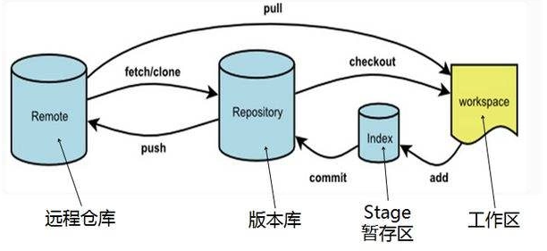

# Development Tutorial

## Author

Daniel Xu


## 🚀 GIT指南

Git（读音为/gɪt/）是一个开源的分布式版本控制系统，可以有效、高速地处理从很小到非常大的项目版本管理。其中，分布式相比于集中式的最大区别在于开发者可以提交到本地，每个开发者通过克隆（git clone），在本地机器上拷贝一个完整的Git仓库。

### 基本概念



- 工作区：用来编辑保存项目文件的地方，也是用户能直接操作到的地方，也就是你在电脑里能看到的目录。
- 暂存区：英文叫stage, 或index。保存了下次将提交的文件列表信息，一般存放在 ".git目录下" 下的index文件（.git/index）中。
- 版本库：工作区有一个隐藏目录.git，这个不算工作区，而是Git的版本库。之所以说git 快，是因为它是分布式版本控制系统，大部分提交都是对本地仓库而言的，不依赖网络，最后一次会推送的到远程仓库。
- 远程仓库：托管代码的服务器，可以简单的认为是你项目组中的一台电脑用于远程数据交换。

详细教程参考：[Git教程](https://www.liaoxuefeng.com/wiki/896043488029600)

### 常用命令清单

以下列出一些较为常见的命令，更多可参考：[常用 Git 命令清单](https://www.ruanyifeng.com/blog/2015/12/git-cheat-sheet.html)

#### 新建代码库

```/
# 在当前目录新建一个Git代码库
$ git init

# 新建一个目录，将其初始化为Git代码库
$ git init [project-name]

# 下载一个项目和它的整个代码历史
$ git clone [url]
```

#### 配置

```/
# 显示当前的Git配置
$ git config --list

# 编辑Git配置文件
$ git config -e [--global]

# 设置提交代码时的用户信息
$ git config [--global] user.name "[name]"
$ git config [--global] user.email "[email address]"
```

#### 代码提交与同步

```/
# 添加指定文件到暂存区
$ git add [file1] [file2] ...

# 添加当前目录的所有文件到暂存区
$ git add .

# 提交暂存区到仓库区
$ git commit -m [message]

# 提交暂存区的指定文件到仓库区
$ git commit [file1] [file2] ... -m [message]

# 提交工作区自上次commit之后的变化，直接到仓库区
$ git commit -a

# 使用一次新的commit，替代上一次提交
# 如果代码没有任何新变化，则用来改写上一次commit的提交信息
$ git commit --amend -m [message]

# 重做上一次commit，并包括指定文件的新变化
$ git commit --amend [file1] [file2] ...

# 下载远程仓库的所有变动
$ git fetch [remote]

# 取回远程仓库的变化，并与本地分支合并
$ git pull [remote] [branch]

# 上传本地指定分支到远程仓库
$ git push [remote] [branch]
```

#### 分支管理

```/
# 列出所有本地分支
$ git branch

# 列出所有远程分支
$ git branch -r

# 新建一个分支，并切换到该分支
$ git checkout -b [branch]

# 切换到指定分支，并更新工作区
$ git checkout [branch-name]

# 合并指定分支到当前分支
$ git merge [branch]

# 选择一个commit，合并进当前分支
$ git cherry-pick [commit]

# 删除分支
$ git branch -d [branch-name]

# 删除远程分支
$ git push origin --delete [branch-name]
$ git branch -dr [remote/branch]
```


## 📖 项目开发规范

以下规范可供参考，欢迎补充。

### GIT规范

多人协作的规范流程参考 [Git 使用规范流程](http://www.ruanyifeng.com/blog/2015/08/git-use-process.html)

#### Commit message书写规范

Git 每次提交代码，都要写 Commit message（提交说明），否则就不允许提交。一般来说，commit message 应该清晰明了，并且能够说明本次提交的目的。本项目下推荐书写规范如下：

```/
<type>(<scope>): <subject>
```

共包含三个字段：`type`（必需）、`scope`（可选）和`subject`（必需）。

##### type

`type`用于说明 commit 的类别，只允许使用下面7个标识。

+ feat：新功能（feature）

+ fix：修补bug

+ docs：文档（documentation）

+ style： 格式（不影响代码运行的变动）

+ refactor：重构（即不是新增功能，也不是修改bug的代码变动）

+ test：增加测试

+ chore：构建过程或辅助工具的变动

##### scope

`scope`用于说明 commit 影响的范围，比如数据层、控制层、视图层等等，视项目不同而不同。

##### subject

`subject`是 commit 目的的简短描述，不超过50个字符。

+ 以动词开头，使用第一人称现在时，比如`change`，而不是`changed`或`changes`

+ 第一个字母小写
+ 结尾不加句号（`.`）

例如：一个规范的Commit message为：

```/
fix(loader): use `false` as default value for `transclude` in component
```

### 分支管理

一般来说，一个项目的代码库存在以下几个分支：

+ **Master**

  Git主分支的名字，默认叫做Master。所有提供给用户使用的正式版本，都在这个主分支上发布。

  （PS：最近由于美国反对种族歧视的运动，有人提出更名为Main）

+ **Develop**（Dev）

  主分支只用来分布重大版本，日常开发应该在另一条分支上完成。我们把开发用的分支，叫做Develop。如果想正式对外发布，就在Master分支上，对Develop分支进行"合并"（merge）。

+ **fixbug**

  修补bug分支。软件正式发布以后，难免会出现bug。这时就需要创建一个分支，进行bug修补。修补bug分支是从Master分支上面分出来的。修补结束以后，再合并进Master和Develop分支。它的命名，可以采用fixbug-*的形式。

+ **feature**

  功能分支，它是为了开发某种特定功能，从Develop分支上面分出来的。开发完成后，要再并入Develop。功能分支的名字，可以采用feature-*的形式命名。

+ **release**

  预发布分支，它是指发布正式版本之前（即合并到Master分支之前），我们可能需要有一个预发布的版本进行测试。它的命名，可以采用release-*的形式。

### 合并注意事项

一般在git merge之前，首先需要把当前分支和要合并的那个分支代码git pull下，这样最新的代码就可以更新到本地仓库。如果在使用git merge合并过程中，遇到了冲突，就需要手动进行消除冲突，此时，一般编辑器会显示如下代码块，对于有冲突的部分进行提示，最终的决定权在我们自己手上。

```/
>>>>> head
这块是自己分支最新的代码
=======
这块是master分支的代码
<<<<<<<<master
```

一般建议在开发时遵循以下几点：

1. 更新当前分支代码的时候一定要使用 `git pull origin xxx`
2. 合并代码的时候按照最新分支优先合并为原则
3. 要经常从上游分支更新代码，如果长时间不更新上游分支代码容易出现大量冲突